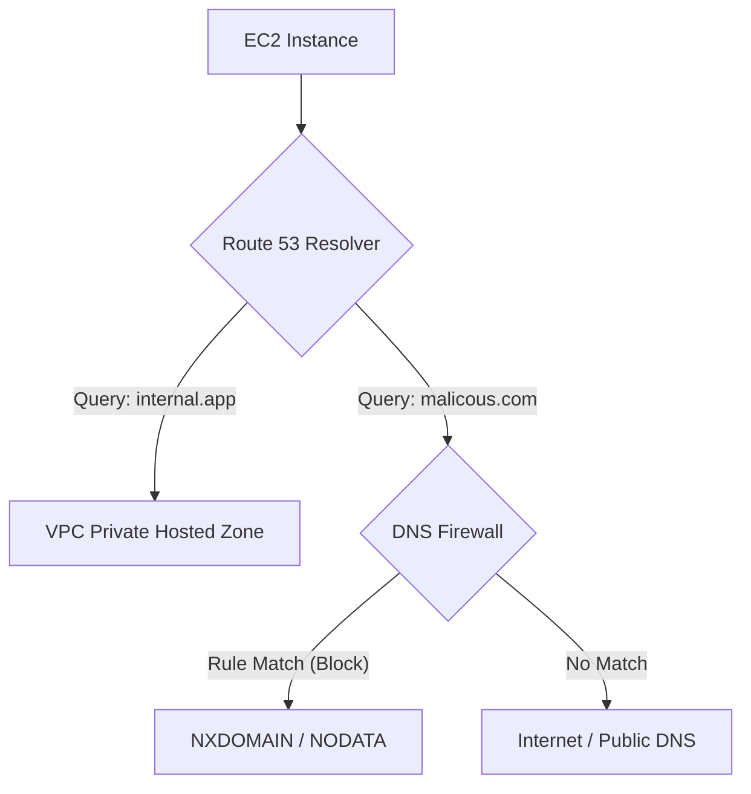

# Mastering AWS Route 53 Resolver and DNS Security

This guide covers the configuration and management of Amazon Route 53 Resolver and DNS Firewall, essential for hybrid cloud connectivity and network security in the AWS SysOps Administrator curriculum.

## Learning Objectives

By the end of this module, you should be able to:
*   **Configure** Route 53 Resolver endpoints for hybrid DNS resolution.
*   **Implement** DNS Firewall rule groups to filter outbound DNS queries.
*   **Manage** centralized DNS security policies using AWS Firewall Manager.
*   **Prioritize** DNS rules correctly to ensure organizational compliance and local flexibility.

## Key Terms & Glossary

*   **Route 53 Resolver**: The regional service that answers DNS queries for local VPC domain names and forwards queries to external DNS servers.
*   **Inbound Endpoint**: A Resolver component that allows on-premises DNS servers to forward queries to AWS.
*   **Outbound Endpoint**: A Resolver component that allows AWS resources to forward DNS queries to on-premises servers or other external DNS.
*   **DNS Firewall**: A feature of Route 53 Resolver that lets you filter outbound DNS queries for known malicious domains.
*   **Rule Group**: A collection of rules that define how to handle DNS queries (e.g., Allow, Block, Alert).

## The "Big Idea"

DNS is often the "first hop" in a network connection. By controlling the **Route 53 Resolver**, you aren't just managing how names are translated to IPs; you are establishing a security perimeter. The Resolver acts as a bridge between your private AWS network and the outside world. Integrating it with **AWS Firewall Manager** allows an organization to enforce a "security baseline" across hundreds of accounts while still allowing individual teams to add their own specific rules in the "middle" priority tier.

## Formula / Concept Box

| Feature | Logic / Rule | Priority Range |
| :--- | :--- | :--- |
| **Firewall Manager (High)** | Mandatory organizational blocks (e.g., Command & Control) | 1 – 9 |
| **Local Account Rules** | Application-specific DNS rules | 10 – 9000 |
| **Firewall Manager (Low)** | Default organizational catch-alls | 9001 – 10000 |
| **Default Action** | If no rules match | Allow (by default) |

## Hierarchical Outline

1.  **Route 53 Resolver Fundamentals**
    *   **Internal Resolution**: Default VPC behavior ($169.254.169.253$).
    *   **Hybrid Connectivity**: Using **Inbound** and **Outbound Endpoints** via Direct Connect or VPN.
    *   **Forwarding Rules**: Mapping specific domains (e.g., `corp.internal`) to specific IP addresses.
2.  **DNS Firewall Architecture**
    *   **Rule Groups**: Reusable collections of rules.
    *   **Domain Lists**: Custom lists of domains or AWS-managed "Managed Domain Lists."
    *   **VPC Association**: Linking a Rule Group to one or more VPCs.
3.  **Centralized Management via Firewall Manager**
    *   **Compliance**: Identifying non-compliant VPCs that lack required firewall associations.
    *   **Auto-remediation**: Automatically applying `FMManaged_` associations to new VPCs.
    *   **Resource Sharing**: Utilizing **AWS RAM** to share rule groups across an Organization.

## Visual Anchors

### DNS Query Flow



### Hybrid DNS Setup

```tikz
\begin{tikzpicture}[node distance=2cm, every node/.style={rectangle, draw, fill=blue!10, text centered, rounded corners, minimum height=1cm}]
    \node (onprem) {On-Premises DNS Server};
    \node (vpn) [right of=onprem, xshift=2cm] {VPN / Direct Connect};
    \node (inbound) [above right of=vpn, xshift=2cm] {Inbound Endpoint};
    \node (outbound) [below right of=vpn, xshift=2cm] {Outbound Endpoint};
    \node (vpc) [right of=vpn, xshift=5cm] {AWS VPC};

    \draw[<->, thick] (onprem) -- (vpn);
    \draw[->, thick] (vpn) -- (inbound);
    \draw[->, thick] (inbound) -- (vpc);
    \draw[->, thick] (vpc) -- (outbound);
    \draw[->, thick] (outbound) -- (vpn);
\end{tikzpicture}
```

## Definition-Example Pairs

*   **Forwarding Rule**: A configuration that tells the Resolver where to send queries for a specific domain.
    *   *Example*: A rule stating that any query ending in `.corp` should be sent to $10.0.1.50$ (the on-premises DNS IP).
*   **Managed Domain List**: A list of domains maintained by AWS that are known for malware or botnets.
    *   *Example*: Enabling the `AWSManagedDomainsMalwareDomainList` to automatically block traffic to known virus command centers.
*   **Non-compliant Policy**: A state where a resource does not meet the requirements defined in Firewall Manager.
    *   *Example*: A developer creates a new VPC but does not associate the mandatory corporate DNS Firewall rule group; Firewall Manager flags this and can auto-attach the rule group.

## Worked Examples

### Scenario: Configuring Hybrid Resolution for `dev.local` 

1.  **Identify IPs**: Your on-premises DNS server is at $192.168.1.10$.
2.  **Create Outbound Endpoint**: In the Route 53 console, create an Outbound Endpoint. Select your VPC and at least two subnets in different Availability Zones for high availability.
3.  **Create Forwarding Rule**:
    *   **Rule Type**: Forward.
    *   **Domain Name**: `dev.local`.
    *   **Target IP**: $192.168.1.10$.
4.  **Associate**: Link this rule to the specific VPCs where your developers work.
5.  **Test**: From an EC2 instance, run `dig dev.local`. The Resolver sees the rule, uses the Outbound Endpoint to cross the VPN, and returns the on-premises IP.

## Checkpoint Questions

1.  If a DNS Firewall rule group from Firewall Manager has a priority of 5, and a local admin creates a rule with priority 100, which rule is evaluated first?
2.  Which AWS service must be enabled to share DNS Firewall Rule Groups across an entire AWS Organization?
3.  What is the purpose of an Inbound Endpoint compared to an Outbound Endpoint?
4.  A VPC has a DNS Firewall rule set to ALERT for a specific domain. What happens when a user attempts to resolve that domain?

<details>
<summary>Click to see answers</summary>

1. The Firewall Manager rule (Priority 5) is evaluated first because it falls in the 1-9 range.
2. AWS Resource Access Manager (RAM).
3. Inbound Endpoints allow external/on-premise servers to query AWS DNS; Outbound Endpoints allow AWS resources to query external/on-premise DNS.
4. The resolution succeeds, but a record of the query is logged for security auditing.

</details>