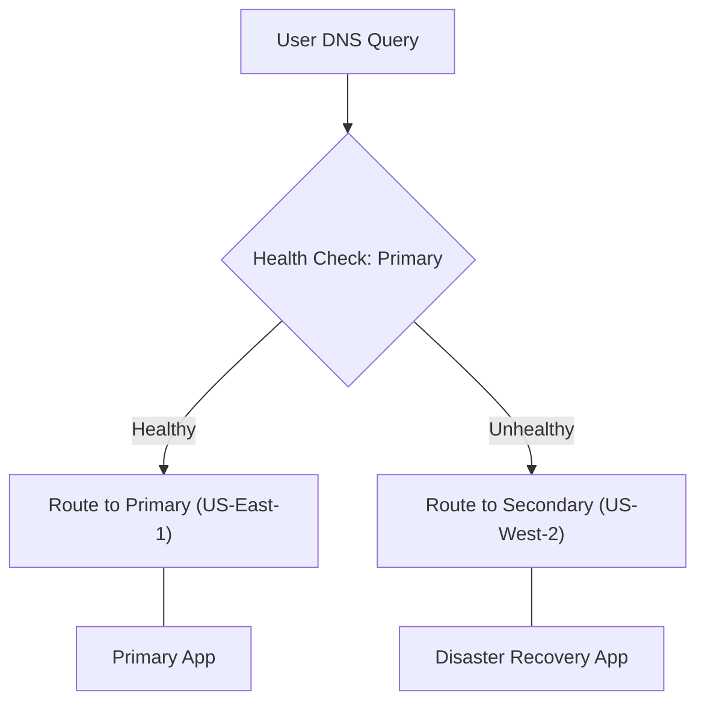

# Route 53 Mastery: Routing Policies, Configuration, and Query Logging

Amazon Route 53 is a highly available and scalable Domain Name System (DNS) web service. Beyond simple domain registration, it provides sophisticated routing mechanisms that allow SysOps administrators to manage global traffic, implement disaster recovery, and monitor DNS health.

## Learning Objectives
By the end of this guide, you should be able to:
- **Distinguish** between the seven primary Route 53 routing policies.
- **Configure** health checks to support DNS failover mechanisms.
- **Implement** query logging for auditing and troubleshooting DNS traffic.
- **Optimize** network latency using proximity-based routing.
- **Secure** outbound VPC traffic using Route 53 Resolver DNS Firewall.

## Key Terms & Glossary
- **Hosted Zone**: A container for records that define how you want to route traffic for a domain (e.g., example.com) and its subdomains.
- **Alias Record**: An AWS-specific DNS extension that points to AWS resources (like CloudFront or ELBs). Unlike CNAMEs, Alias records can be created for the zone apex (the root domain).
- **TTL (Time to Live)**: The amount of time, in seconds, that a DNS resolver caches a record before requesting a new one.
- **Health Check**: A mechanism that monitors the health and performance of your resources (endpoints, other health checks, or CloudWatch alarms).
- **DNS Resolver**: The service that responds to DNS queries from resources within a VPC.

## The "Big Idea"
Think of Route 53 not just as a static phonebook, but as an **intelligent traffic controller**. While traditional DNS just provides an IP address, Route 53 evaluates the "health" of the destination, the "location" of the user, and the "business logic" (weights) defined by the administrator to ensure the user is directed to the most appropriate, available resource.

## Formula / Concept Box

| Feature | Description | Best For... |
| :--- | :--- | :--- |
| **Simple** | Single resource, no logic. | Basic web servers. |
| **Weighted** | Assign relative weights (e.g., 70/30). | A/B testing, Blue/Green deployments. |
| **Latency** | Routes to the AWS region with lowest latency. | Performance-critical global apps. |
| **Failover** | Active-Passive setup. | Disaster Recovery (DR). |
| **Geolocation** | Routes based on user's physical location. | Content localization/legal compliance. |
| **Geoproximity** | Routes based on resource proximity + "bias." | Complex geographic traffic shifting. |
| **Multi-value** | Returns up to 8 healthy records. | Basic load balancing + health checks. |

## Hierarchical Outline
1. **DNS Foundations in AWS**
    - **Public Hosted Zones**: Accessible from the internet.
    - **Private Hosted Zones**: Only accessible within specified VPCs.
    - **Record Types**: A, AAAA, CNAME, MX, TXT, and **Alias**.
2. **Routing Policy Deep-Dive**
    - **Weighted Routing**: Distributing traffic by percentage.
    - **Latency-based**: Serving users from the fastest responding region.
    - **Failover**: Primary/Secondary logic using Health Checks.
3. **Monitoring and Security**
    - **DNS Query Logging**: Capturing log data (Internal/External).
    - **Resolver DNS Firewall**: Filtering outbound DNS queries to block malicious domains.
4. **Operational Troubleshooting**
    - Analyzing TTL impacts on record propagation.
    - Using CloudWatch to monitor health check failures.

## Visual Anchors

### Failover Routing Logic

### Weighted Traffic Split (TikZ)
\begin{tikzpicture}[node distance=2cm]
\draw[thick, ->] (0,0) -- (2,1) node[midway, above, sloped] {80\% Traffic};
\draw[thick, ->] (0,0) -- (2,-1) node[midway, below, sloped] {20\% Traffic};
\draw (2.5,1) circle (0.5cm) node {V1};
\draw (2.5,-1) circle (0.5cm) node {V2};
\node at (-1,0) [draw, rectangle] {Route 53};
\node at (5,0) [draw, dashed] {Weighted Policy};
\end{tikzpicture}

## Definition-Example Pairs
- **Geoproximity Routing**: Routing based on the geographic location of your resources and optionally shifting traffic from one resource to another by specifying a bias.
    - *Example*: An application has servers in London and Tokyo. By setting a positive bias on the London region, users in Central Asia (who might normally go to Tokyo) are "pulled" toward the London servers to balance the load.
- **Multi-value Answer Routing**: A policy that allows Route 53 to return multiple values, such as IP addresses for your web servers, in response to DNS queries.
    - *Example*: Instead of a Load Balancer, you have 5 independent web servers. Multi-value routing returns the IPs of the healthy ones, providing a simple form of DNS-level load balancing.

## Worked Examples

### Scenario 1: Implementing a Blue/Green Deployment
**Goal**: Shift 10% of production traffic to a new "Green" environment to test stability.
1. **Create Records**: In your Hosted Zone, create two 'A' records with the same name (e.g., `app.example.com`).
2. **Set Policy**: Choose **Weighted** for both.
3. **Assign Weights**: Set the Blue record weight to `90` and the Green record weight to `10`.
4. **Validation**: Monitor the Green environment's logs to ensure the 10% traffic is flowing as expected.

### Scenario 2: Configuring Public Query Logging
**Goal**: Audit all DNS queries made to a public domain for security analysis.
1. **CloudWatch Logs**: Create a Log Group in the `us-east-1` region (Query logging is globally managed there).
2. **Resource Policy**: Update the Log Group's resource policy to allow Route 53 to publish logs.
3. **Enable Logging**: In the Route 53 console, select the Hosted Zone and click "Configure query logging."
4. **Result**: Queries like `dig example.com` will now populate the log group with timestamps, query types, and source IP information.

## Checkpoint Questions
1. What is the primary difference between **Geolocation** and **Geoproximity** routing?
2. Why must an **Alias** record be used instead of a CNAME for a Zone Apex (root domain) pointing to an ELB?
3. If a resource is marked as **Unhealthy** by a Route 53 health check, what happens to the DNS record in a Failover policy?
4. In which AWS Region must you create the CloudWatch Log Group to enable Route 53 public query logging?
5. How can **DNS Firewall** prevent data exfiltration from a VPC?

> [!TIP]
> Remember: **C**NAMEs cannot coexist with other records for the same name, but **A**lias records can. Always prefer Alias records for AWS resources to avoid additional DNS query charges and to allow for root domain mapping.