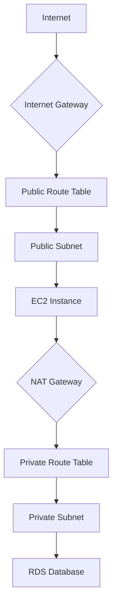

# AWS VPC Administration: Comprehensive Study Guide

This guide covers the essential administration tasks for Amazon Virtual Private Cloud (VPC), focusing on configuration, connectivity, and troubleshooting as required for the AWS Certified SysOps Administrator Associate (SOA-C03) exam.

## Learning Objectives
After studying this material, you should be able to:
- Configure core VPC components including subnets, route tables, and gateways via the AWS Console and CLI.
- Implement private connectivity strategies using NAT Gateways and VPC Endpoints.
- Manage large-scale inter-VPC connectivity via Peering and Transit Gateways.
- Diagnose and remediate network connectivity issues using VPC Flow Logs and Reachability Analyzer.

## Key Terms & Glossary
- **VPC (Virtual Private Cloud):** A logically isolated section of the AWS Cloud where you can launch AWS resources in a virtual network that you define.
- **CIDR (Classless Inter-Domain Routing):** A method for allocating IP addresses and IP routing (e.g., `10.0.0.0/16`).
- **Subnet:** A range of IP addresses in your VPC; can be public (with a route to an IGW) or private.
- **IGW (Internet Gateway):** A horizontally scaled, redundant, and highly available VPC component that allows communication between your VPC and the internet.
- **VPC Endpoint:** A private connection to supported AWS services and VPC endpoint services powered by PrivateLink.
- **Transit Gateway:** A network transit hub that you can use to interconnect your virtual private clouds (VPCs) and on-premises networks.

## The "Big Idea"
The VPC is your **Virtual Data Center**. Everything you build on AWS lives inside a network you control. Administration isn't just about creating the network, but about managing the flow of traffic, ensuring security through isolation, and optimizing the cost of moving data between services.

## Formula / Concept Box

| Command / Concept | Description | CLI Syntax |
| :--- | :--- | :--- |
| **Create VPC** | Initialize a new virtual network. | `aws ec2 create-vpc --cidr-block <CIDR>` |
| **Describe VPCs** | List all VPCs in a region. | `aws ec2 describe-vpcs` |
| **Create Tag** | Add metadata (Key/Value) to a resource. | `aws ec2 create-tags --resources <ID> --tags Key=k,Value=v` |
| **Default VPC CIDR** | Standard block for default VPCs. | `172.31.0.0/16` |

## Hierarchical Outline
- **I. Foundational Configuration**
    - **CIDR Blocks:** Defining the primary and secondary IP ranges.
    - **Subnets:** Segmenting the VPC by Availability Zone (AZ).
    - **Route Tables:** Defining the traffic path for each subnet.
- **II. Connectivity Gateways**
    - **Internet Gateway (IGW):** Enables internet access for public subnets.
    - **NAT Gateway:** Enables outbound-only internet access for private subnets.
    - **Egress-Only IGW:** Provides egress for IPv6 traffic from private subnets.
- **III. Advanced Networking**
    - **VPC Peering:** Direct connection between two VPCs (non-transitive).
    - **Transit Gateway (TGW):** Hub-and-spoke model for many VPCs.
    - **VPC Endpoints:** Interface (ENI) or Gateway (S3/DynamoDB) types for private service access.
- **IV. Security & Monitoring**
    - **Security Groups:** Stateful instance-level firewalls.
    - **Network ACLs:** Stateless subnet-level firewalls.
    - **VPC Flow Logs:** Capturing IP traffic metadata.

## Visual Anchors

### VPC Traffic Flow Architecture


### Inter-VPC Connectivity Models
\begin{tikzpicture}[node distance=2cm, every node/.style={draw, rectangle, minimum width=2.5cm, minimum height=1cm, align=center}]
    \node (tgw) [circle, fill=blue!10] {Transit\\Gateway};
    \node (vpc1) [above left=of tgw] {VPC A};
    \node (vpc2) [above right=of tgw] {VPC B};
    \node (vpc3) [below=of tgw] {VPC C};

    \draw [<->, thick] (tgw) -- (vpc1);
    \draw [<->, thick] (tgw) -- (vpc2);
    \draw [<->, thick] (tgw) -- (vpc3);

    \node at (4, 0) [draw=none] {\mbox{Hub-and-Spoke Topology}};
\end{tikzpicture}

## Definition-Example Pairs
- **Public Subnet:** A subnet whose route table has an entry to an Internet Gateway.
    - *Example:* A web server subnet hosting a site accessible via `www.example.com`.
- **Private Subnet:** A subnet that has no direct route to the Internet Gateway.
    - *Example:* A database subnet containing sensitive customer records that should never be reached from the internet.
- **Stateful Firewall:** A firewall that remembers the state of connection (if request is allowed, response is automatically allowed).
    - *Example:* Security Groups—if you allow inbound HTTP (80), the outbound response is automatically permitted regardless of outbound rules.

## Worked Examples

### Task: Provisioning a New VPC via CLI
Following the SysOps administration workflow, we will create a VPC, tag it, and attach an Internet Gateway.

1. **Create the VPC**
   Execute the command to create a network with a `10.180.0.0/16` CIDR block and extract the ID.
   ```bash
   aws ec2 create-vpc --cidr-block 10.180.0.0/16 --output text --query 'Vpc.VpcId'
   ```
   *Output:* `vpc-0fbf21d5550493965`

2. **Tag the Resource**
   Identify the resource for administrative tracking.
   ```bash
   aws ec2 create-tags --resources vpc-0fbf21d5550493965 --tags Key=vpcname,Value=MyTestVPC
   ```

3. **Create an Internet Gateway**
   ```bash
   aws ec2 create-internet-gateway --output text --query 'InternetGateway.InternetGatewayId'
   ```
   *Output:* `igw-0a500c14869869d02`

4. **Attach IGW to VPC**
   ```bash
   aws ec2 attach-internet-gateway --internet-gateway-id igw-0a500c14869869d02 --vpc-id vpc-0fbf21d5550493965
   ```

## Checkpoint Questions
1. What is the default CIDR block for a default VPC automatically provisioned by AWS?
2. Which AWS CLI command would you use to view the JSON description of all VPCs in your current region?
3. True or False: VPC Peering connections are transitive, meaning if VPC A is peered with B, and B is peered with C, A is automatically peered with C.
4. Which tool allows you to perform automated network path validation to see if a source can reach a destination?
5. When creating a public route using the CLI, what is the standard destination CIDR block used to represent 'all internet traffic'?

<details>
<summary><b>Click for Answers</b></summary>
1. 172.31.0.0/16
2. `aws ec2 describe-vpcs`
3. False. Peering is non-transitive.
4. VPC Reachability Analyzer.
5. 0.0.0.0/0
</details>