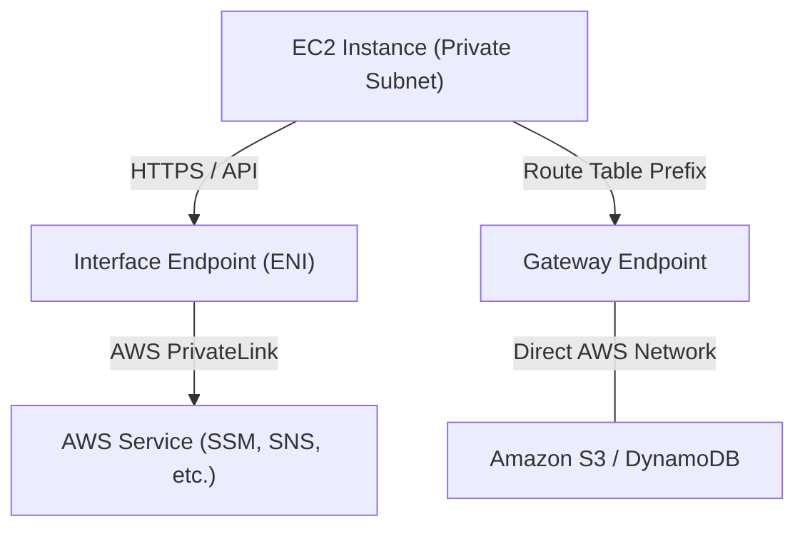
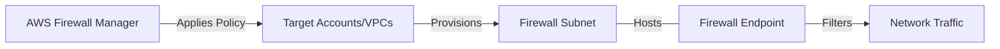

# Curriculum Overview: Implement Private Connectivity Using VPC Endpoints

> This curriculum outline defines the progressive learning path, core modules, and expected outcomes for mastering AWS VPC Endpoints. It focuses heavily on security, network isolation, and SysOps-level troubleshooting aligned with the SOA-C03 exam domains.

## Prerequisites

Before diving into private connectivity with VPC Endpoints, learners must possess a foundational understanding of AWS network design and access management.

* **VPC Fundamentals:** Understanding of subnets (public vs. private), route tables, Security Groups, and Network ACLs.
* **Gateways:** Familiarity with Internet Gateways (IGW) and NAT Gateways, including their limitations and public internet requirements.
* **IAM Basics:** Knowledge of Identity and Access Management policies, including resource-based policies and the principle of least privilege.
* **DNS Management:** Basic comprehension of Amazon Route 53 and private hosted zones.

> [!NOTE] 
> If you are not familiar with CIDR block calculations or default routing behaviors in a VPC, review the foundational **VPC Administration** modules before proceeding.

## Module Breakdown

This curriculum is divided into 5 progressive modules, transitioning from basic conceptual architectures to complex, multi-VPC firewall endpoint deployments.

| Module | Title | Difficulty | Core Focus |
| :--- | :--- | :--- | :--- |
| **1** | **VPC Endpoint Architectures** | Beginner | Gateway vs. Interface concepts, AWS PrivateLink. |
| **2** | **Gateway Endpoints: S3 & DynamoDB** | Intermediate | Route table adjustments, Endpoint policies. |
| **3** | **Interface Endpoints in Depth** | Intermediate | Private DNS, Elastic Network Interfaces (ENIs), Security Groups. |
| **4** | **Centralized Firewall Endpoints** | Advanced | AWS Network Firewall, Firewall Manager, Inspection VPCs. |
| **5** | **Monitoring & Troubleshooting** | Advanced | VPC Flow Logs, Reachability Analyzer, CloudWatch metrics. |

### Architectural Overview

## Learning Objectives per Module

### Module 1: VPC Endpoint Architectures
* Differentiate between Gateway Endpoints and Interface Endpoints.
* Understand the cost models associated with data transfer and hourly endpoint availability.

### Module 2: Gateway Endpoints: S3 & DynamoDB
* Configure a Gateway Endpoint for Amazon S3 and Amazon DynamoDB.
* Modify subnet route tables to direct traffic through the Gateway Endpoint.
* Write strict VPC Endpoint Policies to prevent data exfiltration.

### Module 3: Interface Endpoints in Depth
* Provision Interface Endpoints powered by AWS PrivateLink.
* Attach and configure Security Groups directly to the endpoint ENI.
* Resolve overlapping DNS names using Private Hosted Zones.

### Module 4: Centralized Firewall Endpoints
* Deploy firewall endpoints automatically using AWS Firewall Manager.
* Design an "Inspection VPC" to route and filter traffic from multiple organizational VPCs.
* Configure distributed vs. centralized firewall deployment models.

### Module 5: Monitoring & Troubleshooting
* Capture and inspect IP traffic data using VPC Flow Logs.
* Validate end-to-end network paths without sending real traffic using VPC Reachability Analyzer.

## Success Metrics

How do you know you have mastered this curriculum? You should be able to successfully demonstrate the following:

* **Zero Public Routing:** An EC2 instance with no public IP, no IGW, and no NAT Gateway can successfully assume an IAM role, communicate with Systems Manager (SSM), and upload files to an S3 bucket.
* **Policy Validation:** An attached Endpoint Policy successfully blocks all `s3:PutObject` requests to any bucket outside of your specific AWS Account ID.
* **Firewall Compliance:** AWS Firewall Manager successfully deploys firewall endpoints across 3 different VPCs without route table conflicts.
* **Cost Calculation Mastery:** Accurately project the cost of Interface Endpoints using the standard formula:

$$ Cost_{total} = (C_{hourly} \times Hours) + (C_{data} \times Volume_{GB}) $$

Where $C_{hourly}$ is the hourly rate per availability zone and $C_{data}$ is the per-GB processing fee.

## Real-World Application

Why does this matter in a professional cloud environment?

1. **Security & Compliance:** Regulatory standards (like HIPAA or PCI-DSS) often mandate that sensitive data cannot traverse the public internet. VPC Endpoints keep traffic strictly within the AWS global backbone.
2. **Preventing Data Exfiltration:** By attaching an IAM policy directly to a VPC Endpoint (Resource-Based Policy), administrators can ensure that even if a developer's credentials are leaked, data cannot be pushed to an attacker's external S3 bucket.
3. **Network Centralization & Inspection:** In enterprise environments using the AWS Firewall Manager, traffic filtering becomes automated. You create the policy once, and the endpoints are seamlessly deployed to every new VPC in the organization, drastically reducing administrative overhead.
4. **Cost Optimization:** NAT Gateways charge for data processing. For workloads that move terabytes of data to S3 or DynamoDB, replacing NAT Gateway traffic with a free Gateway Endpoint yields massive cost savings.