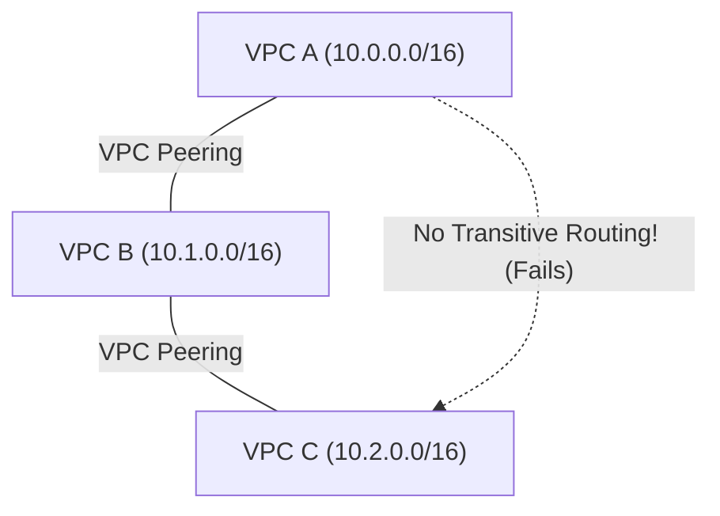

# Curriculum Overview: Inter-VPC Connectivity via Peering and Transit Gateway

This curriculum provides a structured pathway to mastering AWS networking, specifically focusing on connecting multiple Virtual Private Clouds (VPCs) at scale. Designed to align with the AWS Certified CloudOps Engineer / SysOps Administrator (SOA-C03) standards, this learning path covers the operational, security, and routing fundamentals required to manage inter-VPC traffic securely and efficiently.

---

## Prerequisites

Before diving into inter-VPC connectivity, learners must have a solid foundation in core AWS networking concepts. You should be comfortable with the following:

*   **IPv4 / IPv6 Addressing:** Understanding CIDR (Classless Inter-Domain Routing) notation and subnet masking.
*   **VPC Fundamentals:** Experience creating VPCs, public/private Subnets, and Internet Gateways (IGW).
*   **Routing Basics:** Familiarity with AWS Route Tables and evaluating target destinations (e.g., `0.0.0.0/0` to an IGW).
*   **Command Line Interface:** Basic usage of the AWS CLI for infrastructure deployment (e.g., `aws ec2 create-vpc`).

> [!IMPORTANT]
> AWS reserves 5 IP addresses in every subnet. Before designing connected architectures, ensure you understand basic IP availability calculations:
> $$ \text{Available IPs} = 2^{(32 - \text{CIDR mask})} - 5 $$

---

## Module Breakdown

This curriculum is divided into progressively advanced modules. 

| Module | Topic | Difficulty | Est. Time |
| :--- | :--- | :--- | :--- |
| **Module 1** | VPC Basics & IP Address Management (IPAM) | Foundational | 2 hours |
| **Module 2** | VPC Peering Connections & Route Tables | Intermediate | 3 hours |
| **Module 3** | AWS Transit Gateway (Hub-and-Spoke) | Advanced | 4 hours |
| **Module 4** | Monitoring, Flow Logs, & Troubleshooting | Intermediate | 2.5 hours |
| **Module 5** | Automation & Infrastructure as Code (CLI/CloudFormation) | Advanced | 3 hours |

---

## Learning Objectives per Module

### Module 1: VPC Basics & IPAM
*   Design non-overlapping CIDR blocks across multiple accounts to prevent routing collisions.
*   Configure automated IP tracking using AWS VPC IP Address Manager (IPAM).

### Module 2: VPC Peering
*   Establish 1-to-1 network connections between two VPCs in the same or different regions.
*   Update Route Tables manually to allow traffic to cross the peering connection.
*   Understand and mitigate the limitation of **non-transitive** routing.



### Module 3: AWS Transit Gateway
*   Deploy a Transit Gateway to act as a centralized hub for thousands of VPCs and on-premises networks.
*   Configure Transit Gateway Route Tables for advanced segmentation (e.g., isolating production from development).
*   Compare and contrast the operational overhead of Peering vs. Transit Gateway.

### Module 4: Monitoring & Troubleshooting
*   Capture and analyze network traffic using **VPC Flow Logs**.
*   Perform automated network path validation using **VPC Reachability Analyzer** to diagnose connectivity issues.

### Module 5: Automation
*   Use the AWS CLI to rapidly deploy network resources. For example, provisioning routes:
    `aws ec2 create-route --route-table-id rtb-012345 --destination-cidr-block 10.1.0.0/16 --transit-gateway-id tgw-098765`

---

## Success Metrics

How will you know you have mastered the curriculum? By the end of this course, you should be able to:

1.  **Architectural Decision Making:** Accurately choose between VPC Peering and Transit Gateway based on organizational scale and cost constraints.
2.  **Practical Deployment:** Successfully build a 3-VPC network using Transit Gateway, complete with isolated routing domains, without relying on the AWS console.
3.  **Troubleshooting Mastery:** Given a broken peering connection scenario, identify the misconfigured Route Table or Security Group within 5 minutes.

<details>
<summary>Click to expand: Comparison of Connectivity Methods</summary>

| Feature | VPC Peering | AWS Transit Gateway |
| :--- | :--- | :--- |
| **Topology** | Point-to-Point (Mesh) | Hub and Spoke |
| **Transitive Routing** | No | Yes |
| **Max VPCs** | Limited (125 active per VPC) | Massive Scale (Up to 5,000 attachments) |
| **Management Overhead** | High at scale (complex route tables) | Low at scale (centralized management) |
| **Bandwidth** | Uncapped (Hardware dependent) | Up to 50 Gbps per VPC attachment |

</details>

---

## Real-World Application

Understanding inter-VPC connectivity is one of the most highly sought-after skills in Cloud Operations. In the real world, single-VPC architectures are incredibly rare. 

As organizations grow, they adopt **multi-account, multi-VPC strategies** to limit the "blast radius" of security incidents and cleanly separate billing. For example:
*   **Mergers and Acquisitions:** When two companies merge, a Transit Gateway allows overlapping or discrete networks to be connected efficiently.
*   **Shared Services:** Centralizing enterprise logging, CI/CD tools, or Active Directory in a "Shared Services VPC" requires scalable spoke-to-hub connectivity.

### The Hub and Spoke Architecture

The diagram below demonstrates the standard enterprise pattern you will master in Module 3. A single Transit Gateway manages connections across different environments, dramatically reducing the complexity of route table management.

```tikz
\begin{tikzpicture}
  % Define nodes
  \node[draw, thick, rectangle, rounded corners, fill=blue!10, minimum width=3cm, minimum height=1.5cm, align=center] (tgw) at (0,0) {\textbf{AWS Transit}\\\textbf{Gateway (Hub)}};
  
  \node[draw, thick, rectangle, fill=green!10, minimum width=2.5cm, minimum height=1cm, align=center] (vpcApp) at (-4, 2) {App VPC\\(Spoke)};
  \node[draw, thick, rectangle, fill=green!10, minimum width=2.5cm, minimum height=1cm, align=center] (vpcDb) at (4, 2) {DB VPC\\(Spoke)};
  \node[draw, thick, rectangle, fill=orange!10, minimum width=2.5cm, minimum height=1cm, align=center] (vpcShared) at (0, -3) {Shared Services\\(Spoke)};
  
  % Draw connections
  \draw[<->, thick, >=stealth] (tgw) -- (vpcApp) node[midway, above left] {Attachment};
  \draw[<->, thick, >=stealth] (tgw) -- (vpcDb) node[midway, above right] {Attachment};
  \draw[<->, thick, >=stealth] (tgw) -- (vpcShared) node[midway, right] {Attachment};
\end{tikzpicture}
```

> [!TIP]
> **Cost Optimization in the Real World:** Transit Gateways charge an hourly fee per attachment *plus* a per-GB data processing fee. If you only have two VPCs that exchange massive amounts of data (e.g., a data warehouse and an analytics tool), a direct **VPC Peering Connection** is far more cost-effective as it lacks the hourly attachment overhead.