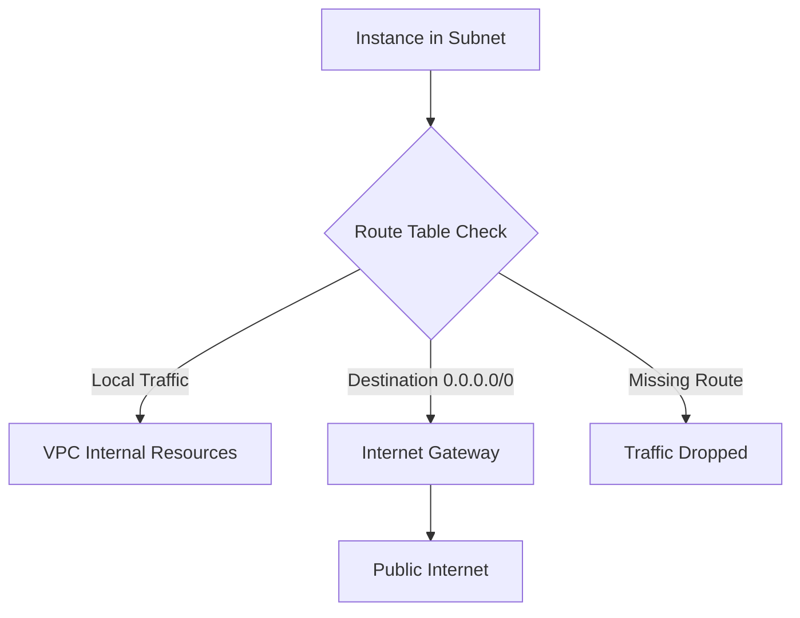

# Mastering AWS Networking: Subnets, Route Tables, and Gateways

This study guide covers the fundamental components of Amazon Virtual Private Cloud (VPC) administration, focusing on the configuration of subnets, the logic of route tables, and the implementation of gateways for internet connectivity.

## Learning Objectives

By the end of this module, you will be able to:
- Provision and tag subnets within specific Availability Zones using the AWS CLI.
- Configure and attach Internet Gateways (IGW) to a VPC.
- Create and modify route table entries to enable public internet access.
- Associate subnets with specific route tables to define network boundaries.
- Identify non-compliant routing configurations using AWS Firewall Manager.

## Key Terms & Glossary

- **VPC (Virtual Private Cloud):** A logically isolated section of the AWS Cloud where you can launch AWS resources in a defined virtual network.
- **Subnet:** A range of IP addresses in your VPC; can be public (has a route to an IGW) or private.
- **CIDR (Classless Inter-Domain Routing):** A method for allocating IP addresses and IP routing (e.g., `10.0.0.0/16`).
- **Internet Gateway (IGW):** A VPC component that allows communication between your VPC and the internet.
- **Route Table:** A set of rules, called routes, that are used to determine where network traffic from your subnet or gateway is directed.
- **NAT Gateway:** A Network Address Translation service that allows instances in a private subnet to connect to the internet while preventing the internet from initiating a connection with those instances.

## The "Big Idea"

Think of a **VPC** as a private gated community. The **Subnets** are individual neighborhoods within that community. The **Internet Gateway** is the main security gate connecting the community to the outside world. The **Route Table** is the GPS/directory that tells residents (traffic) which gate to use to get to a specific destination. Without a properly configured Route Table and Gateway, your neighborhoods remain isolated from the rest of the world.

## Formula / Concept Box

| Concept | Rule / Syntax | Goal |
| :--- | :--- | :--- |
| **Default Route** | `0.0.0.0/0` | Directs all unknown traffic to a specific target (usually an IGW or NAT). |
| **Most Specific Route** | Longest Prefix Match | If multiple routes exist, the most specific one (smallest CIDR) is always chosen. |
| **Subnet Size** | $2^{(32-n)} - 5$ | The number of usable IP addresses in a `/n` subnet (AWS reserves 5 IPs). |

## Hierarchical Outline

- **I. VPC Infrastructure Basics**
    - **VPC Creation**: Defining the primary CIDR block.
    - **Availability Zones (AZ)**: Physical isolation for high availability.
- **II. Subnet Configuration**
    - **Public Subnets**: Associated with a route table that has a path to an **Internet Gateway**.
    - **Private Subnets**: Do not have a direct path to an IGW; often use **NAT Gateways**.
- **III. Gateway Management**
    - **Internet Gateway (IGW)**: Horizontal scaling, redundant, and highly available.
    - **Egress-Only IGW**: Specifically for IPv6 traffic to maintain privacy.
- **IV. Routing Logic**
    - **Main Route Table**: The default table created with the VPC.
    - **Custom Route Tables**: Created by administrators for granular control over subnet traffic.
- **V. Compliance and Monitoring**
    - **Firewall Manager**: Audits routes for asymmetric routing or bypasses.
    - **VPC Flow Logs**: Used to troubleshoot connectivity by capturing IP traffic.

## Visual Anchors

### Traffic Flow Logic


### VPC Component Hierarchy

\begin{tikzpicture}[node distance=2cm]
    \draw[thick] (0,0) rectangle (8,5);
    \node at (4,4.7) {\textbf{VPC (10.0.0.0/16)}};
    
    \draw[dashed] (0.5,0.5) rectangle (3.5,4);
    \node at (2,3.7) {\textbf{AZ-1a}};
    \draw[fill=blue!10] (0.7,1) rectangle (3.3,2.5);
    \node at (2,1.75) {\text{Public Subnet}};

    \draw[dashed] (4.5,0.5) rectangle (7.5,4);
    \node at (6,3.7) {\textbf{AZ-1b}};
    \draw[fill=red!10] (4.7,1) rectangle (7.3,2.5);
    \node at (6,1.75) {\text{Private Subnet}};
    
    \draw[fill=green!20] (3.5, -0.5) rectangle (4.5, 0.5);
    \node at (4, 0) {\text{IGW}};
    \draw[->, thick] (2,1) -- (2,-0.5) -- (3.5, -0.1);
\end{tikzpicture}

## Definition-Example Pairs

- **Target Gateway**: The destination for a specific route in a route table.
    - *Example*: Setting the target of `0.0.0.0/0` to `igw-0a500c...` to make a subnet public.
- **Asymmetric Routing**: When a packet follows a different path when returning than it did when arriving.
    - *Example*: Inbound traffic enters via an IGW, but the return route attempts to exit via a different firewall endpoint, causing a drop.
- **CIDR Block**: The IP range assigned to a network.
    - *Example*: A subnet with `10.180.1.0/24` provides 256 IP addresses (minus 5 reserved by AWS).

## Worked Examples

### Scenario: Creating a Public Subnet via CLI
Follow these steps to establish a functional public subnet from scratch.

**Step 1: Attach an Internet Gateway**
```bash
aws ec2 attach-internet-gateway --internet-gateway-id igw-0a500c14869869d02 --vpc-id vpc-0fbf21d5550493965
```

**Step 2: Create the Subnet**
Assign a specific CIDR and Availability Zone.
```bash
aws ec2 create-subnet --vpc-id vpc-0fbf21d5550493965 --cidr-block 10.180.1.0/24 --availability-zone us-east-1a
```

**Step 3: Create the Public Route**
Find your Route Table ID and add a route that points all external traffic to the IGW.
```bash
aws ec2 create-route --route-table-id rtb-008f73396f0e4baa8 --gateway-id igw-0a500c14869869d02 --destination-cidr-block 0.0.0.0/0
```

**Step 4: Associate the Table**
Bind the route table to the subnet to apply the routing rules.
```bash
aws ec2 associate-route-table --subnet-id subnet-0747b02d0bb936811 --route-table-id rtb-008f73396f0e4baa8
```

## Checkpoint Questions

1. **Which command is used to link a specific route table to a subnet?**
2. **What destination CIDR block represents all possible internet traffic?**
3. **If a subnet does not have an explicit route table association, which table does it use by default?**
4. **Why might AWS Firewall Manager mark a route table as "noncompliant"?**

> [!TIP]
> **Answer Key:**
> 1. `aws ec2 associate-route-table`
> 2. `0.0.0.0/0` (IPv4) or `::/0` (IPv6)
> 3. The Main Route Table of the VPC.
> 4. If traffic bypasses a required firewall endpoint or if asymmetric routing is detected.