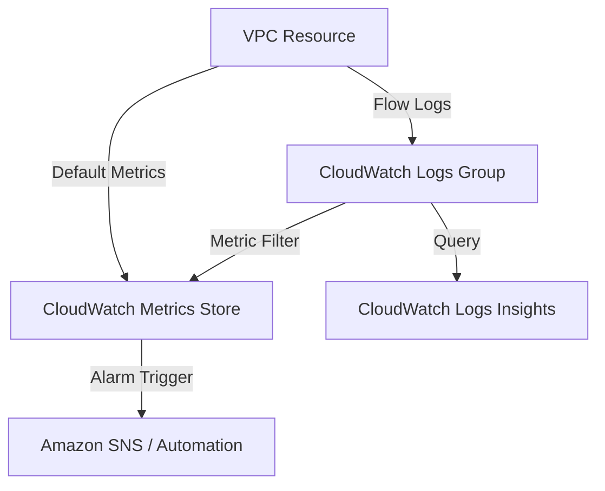

# Amazon CloudWatch: Network Monitoring & Analysis

This guide covers the essential skills for configuring and analyzing network monitoring services within Amazon CloudWatch, a critical component of the AWS Certified SysOps Administrator Associate (SOA-C03) exam. 

## Learning Objectives
After studying this guide, you should be able to:
* Configure **VPC Flow Logs** to capture IP traffic at the interface, subnet, or VPC level.
* Analyze network traffic patterns using **CloudWatch Logs Insights**.
* Create **CloudWatch Alarms** based on network metrics and set up **Anomaly Detection**.
* Build **CloudWatch Dashboards** to visualize cross-account network health.
* Troubleshoot connectivity issues using a combination of metrics and log data.

## Key Terms & Glossary
*   **VPC Flow Logs**: A feature that enables you to capture information about the IP traffic moving to and from network interfaces in your VPC.
*   **Log Group**: A group of log streams that share the same retention, monitoring, and access control settings.
*   **Metric Filter**: A mechanism to extract metric data from log events (e.g., counting how many times "REJECT" appears in a flow log).
*   **CloudWatch Agent**: Software installed on EC2 instances to collect system-level metrics (like `netstat` data) not available by default.
*   **CloudWatch Logs Insights**: A fully managed pay-as-you-go interactive log analytics service.

## The "Big Idea"
In the cloud, network visibility is not about plugging in physical taps; it is about **distributed observability**. Amazon CloudWatch acts as the central nervous system for your network, aggregating telemetry from VPCs, Load Balancers, and CloudFront. The goal is to move from reactive troubleshooting to proactive health monitoring using automated alarms and deep-dive log analysis.

## Formula / Concept Box

| Concept | Metric / Syntax | Use Case |
| :--- | :--- | :--- |
| **Network Throughput** | $NetworkIn + NetworkOut$ | Identifying bandwidth saturation on EC2 instances. |
| **Packet Loss Proxy** | $NetworkPacketsIn / NetworkPacketsOut$ | Identifying asymmetric routing or drops. |
| **Logs Insights Query** | `filter action="REJECT" | stats count(*) by srcAddr` | Identifying potential port scanning or security group blocks. |

## Hierarchical Outline
1. **Data Collection (The Inputs)**
    * **VPC Flow Logs**: Captures metadata about IP traffic (Source, Destination, Protocol, Action).
    * **Standard Metrics**: `NetworkIn`, `NetworkOut`, `NetworkPacketsIn` (Available every 5 mins by default).
    * **Custom Metrics**: High-resolution metrics (1-second) published via CLI or SDK.
2. **Analysis & Visualization (The Processing)**
    * **CloudWatch Dashboards**: Widgets for `Bytes/Second` vs `Packets/Second` comparison.
    * **Metric Math**: Combining multiple metrics to calculate percentage of rejected traffic.
3. **Alerting & Remediation (The Response)**
    * **Static Alarms**: Alerts when a threshold is breached (e.g., $> 1GB$ traffic).
    * **Anomaly Detection**: Machine learning-based bands that alert on unexpected spikes or drops.

## Visual Anchors

### Network Telemetry Flow


### Packet Analysis Breakdown
\begin{tikzpicture}[scale=1]
\draw[thick] (0,0) rectangle (4,2.5);
\node at (2,2.2) {\mbox{Log Record Structure}};
\draw[fill=blue!10] (0.2,1.5) rectangle (3.8,1.9);
\node at (2,1.7) {\tiny \mbox{Source IP: 10.0.1.5}};
\draw[fill=red!10] (0.2,1.0) rectangle (3.8,1.4);
\node at (2,1.2) {\tiny \mbox{Destination IP: 172.31.0.22}};
\draw[fill=green!10] (0.2,0.5) rectangle (3.8,0.9);
\node at (2,0.7) {\tiny \mbox{Action: REJECT (Check Security Group)}};
\draw[->, thick] (4.2,1.25) -- (5.5,1.25);
\node[right] at (5.5,1.25) {\mbox{CloudWatch Insights Analysis}};
\end{tikzpicture}

## Definition-Example Pairs
*   **Metric Filter**: A rule that searches for specific strings in log files.
    *   *Example*: Creating a filter for `REJECT` in VPC Flow Logs to create a custom metric called `RejectedTrafficCount`.
*   **Composite Alarm**: An alarm that watches multiple other alarms and only triggers if a specific logical condition (AND/OR) is met.
    *   *Example*: Alert only if `NetworkIn` is low **AND** `CPUUtilization` is high (indicating a potential application hang rather than a network drop).

## Worked Examples

### Example 1: Finding the "Top Talkers"
**Scenario**: You notice high NAT Gateway costs and need to find which internal instance is sending the most data to the internet.
1. **Step 1**: Enable VPC Flow Logs for the NAT Gateway's ENI.
2. **Step 2**: Open CloudWatch Logs Insights.
3. **Step 3**: Run the following query:
   ```sql
   stats sum(bytes) as totalBytes by srcAddr
   | sort totalBytes desc
   | limit 10
   ```
4. **Result**: The IP at the top of the list is your "Top Talker."

### Example 2: Detecting a DDoS with Anomaly Detection
**Scenario**: You want to be alerted if your network traffic deviates from its usual seasonal pattern.
1. **Step 1**: Select the `NetworkIn` metric for your Load Balancer.
2. **Step 2**: Click the "Wave" icon to enable Anomaly Detection.
3. **Step 3**: Set the band to $2$ standard deviations.
4. **Step 4**: Create an alarm that triggers if the metric goes `Outside the band`.

## Checkpoint Questions
1. What is the difference between a Security Group "Reject" and a NACL "Reject" in a VPC Flow Log?
2. True or False: CloudWatch provides 1-minute resolution for all EC2 network metrics for free.
3. Which CloudWatch feature allows you to combine logs from different accounts into a single view?
4. How can you automate the recovery of an EC2 instance that fails a network status check?
5. Name the tool used to perform automated network path validation between two AWS resources without sending actual packets.

<details><summary>Click to expand answers</summary>

1. They look identical in the logs as "REJECT". You must determine which is the cause by checking the specific rules applied to the resource.
2. False. Default metrics are 5 minutes. 1-minute resolution (Detailed Monitoring) is a paid feature.
3. CloudWatch Cross-Account Dashboards.
4. Use a CloudWatch Alarm with an "EC2 Action" to trigger an "Instance Recovery".
5. VPC Reachability Analyzer.
</details>