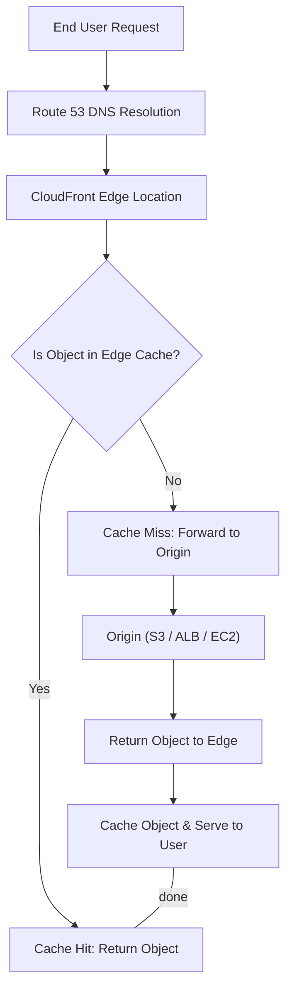
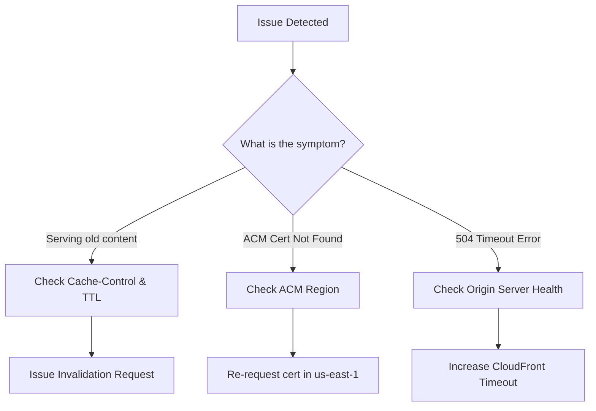

# Curriculum Overview: Identify and Remediate CloudFront Caching Issues

> [!NOTE] 
> **Target Audience:** AWS SysOps Administrators and Cloud Engineers preparing for the SOA-C03 exam.
> **Core Focus:** This curriculum provides a structured path to mastering Amazon CloudFront content delivery, caching behaviors, and troubleshooting edge networking issues.

## Prerequisites

Before diving into CloudFront caching optimization and remediation, learners must possess foundational knowledge in the following areas:

*   **Amazon S3 Fundamentals:** Understanding of S3 buckets, object permissions, and configuring S3 for Static Website Hosting. 
    *   *Example:* Knowing how to configure an S3 bucket to serve a basic HTML index page.
*   **DNS & Route 53:** Familiarity with Domain Name System concepts, A records, CNAMEs, and Route 53 routing policies.
    *   *Example:* Mapping `www.example.com` to a specific AWS resource.
*   **HTTP/HTTPS Protocols:** Understanding of standard HTTP response codes (e.g., 200 OK, 404 Not Found, 502 Bad Gateway) and caching headers (`Cache-Control`, `Expires`).
*   **AWS Certificate Manager (ACM):** Basic understanding of requesting and attaching SSL/TLS certificates for encrypted transit.

## Module Breakdown

This curriculum is designed to progress from foundational architecture to advanced troubleshooting scenarios, ensuring a comprehensive understanding of CloudFront operations.

| Module | Title | Difficulty | Est. Time | Core Topic |
| :--- | :--- | :--- | :--- | :--- |
| **Module 1** | CloudFront Architecture & Origins | Beginner | 2 Hours | Edge locations, S3 Origins, Custom Origins |
| **Module 2** | Cache Policies & Behaviors | Intermediate | 3 Hours | TTL settings, forwarding headers/cookies |
| **Module 3** | Logging & Observability | Intermediate | 2 Hours | Access logs, CloudWatch metrics |
| **Module 4** | Troubleshooting & Remediation | Advanced | 4 Hours | Cache misses, SSL issues, Invalidations |

### CloudFront Request Lifecycle

## Learning Objectives per Module

### Module 1: CloudFront Architecture & Origins
*   **Define Edge Infrastructure:** Understand the relationship between Regions, Availability Zones, Edge Locations, and Regional Edge Caches.
*   **Configure S3 Origins:** Successfully connect a CloudFront distribution to an Amazon S3 bucket using Origin Access Control (OAC) to restrict direct S3 access.
*   **Establish Custom Origins:** Route traffic to Application Load Balancers (ALBs) or external web servers.

### Module 2: Cache Policies & Behaviors
*   **Manage Time-to-Live (TTL):** Configure Default, Minimum, and Maximum TTLs to control how long objects remain in the cache.
*   **Control Cache Keys:** Implement Cache Policies to determine which HTTP headers, cookies, or query strings are included in the cache key.
    *   *Example:* Caching different versions of a site based on the `Accept-Language` header.
*   **Implement SSL/TLS:** Secure distributions using AWS Certificate Manager (ACM).

### Module 3: Logging & Observability
*   **Enable Standard Logging:** Configure CloudFront to deliver access logs to a designated Amazon S3 bucket.
*   **Analyze Traffic Patterns:** Interpret fields within CloudFront access logs (e.g., `x-edge-result-type`, `time-taken`) using Amazon Athena.
*   **Monitor via CloudWatch:** Track key metrics such as `Requests`, `BytesDownloaded`, `4xxErrorRate`, and `5xxErrorRate`.

### Module 4: Troubleshooting & Remediation
*   **Remediate Stale Content:** Use CloudFront Invalidations to force edge locations to fetch the latest objects from the origin.
*   **Resolve SSL/ACM Visibility Errors:** Identify region-specific constraints for certificates. 
    *   *Example:* Troubleshooting why an ACM certificate isn't available for a CloudFront distribution by ensuring the certificate is requested in the `us-east-1` (N. Virginia) region.
*   **Diagnose 5xx Errors:** Differentiate between `502 Bad Gateway` (origin SSL/connection issues) and `504 Gateway Timeout` (origin taking too long to respond).

### Troubleshooting Workflow

## Success Metrics

To know you have mastered this curriculum, you should be able to consistently meet the following operational metrics in a lab or production environment:

1.  **High Cache Hit Ratio:** Maintain an optimal cache hit ratio for static assets, proving that cache policies are correctly configured to prevent unnecessary origin fetches.
    
    $$ \text{Cache Hit Ratio} = \left( \frac{\text{Cache Hits}}{\text{Total Requests}} \right) \times 100 $$
    
2.  **Zero Direct S3 Access:** Validate that users cannot bypass CloudFront to access the underlying S3 origin directly (verified via IAM/Bucket Policies and OAC).
3.  **Log Analysis Proficiency:** Successfully query standard CloudFront access logs to locate specific request IDs causing `5xx` errors within 5 minutes of an incident.
4.  **Cost Optimization:** Demonstrate reduced data egress costs by offloading traffic from EC2/S3 to the CloudFront edge network.

## Real-World Application

Understanding CloudFront caching is not just an exam requirement; it is a critical skill for maximizing performance and minimizing costs in the real world.

> [!TIP]
> **Scenario: The Movie Trailer Launch**
> Imagine your company is launching a highly anticipated movie trailer. Hosting the video file directly on a single Amazon EC2 instance or S3 bucket could result in high latency for global users and massive AWS egress costs.

**The Solution:**
By placing Amazon CloudFront in front of the S3 bucket acting as the origin, you cache the frequently accessed movie trailer at Edge Locations worldwide. 

**The Benefits:**
*   **Performance:** End users download the trailer from a server physically closer to them, drastically reducing buffering and load times.
*   **Cost Efficiency:** Data transferred out of CloudFront to the internet is often cheaper than data transferred out of S3 directly. Plus, the origin experiences less load, reducing compute and read costs.
*   **Disaster Recovery:** CloudFront can be configured with Origin Failover. If the primary web server goes down, CloudFront can automatically route user requests to a secondary S3 bucket hosting a simple "Please stand by" static error page, maintaining a professional web presence during an outage.