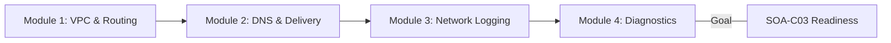
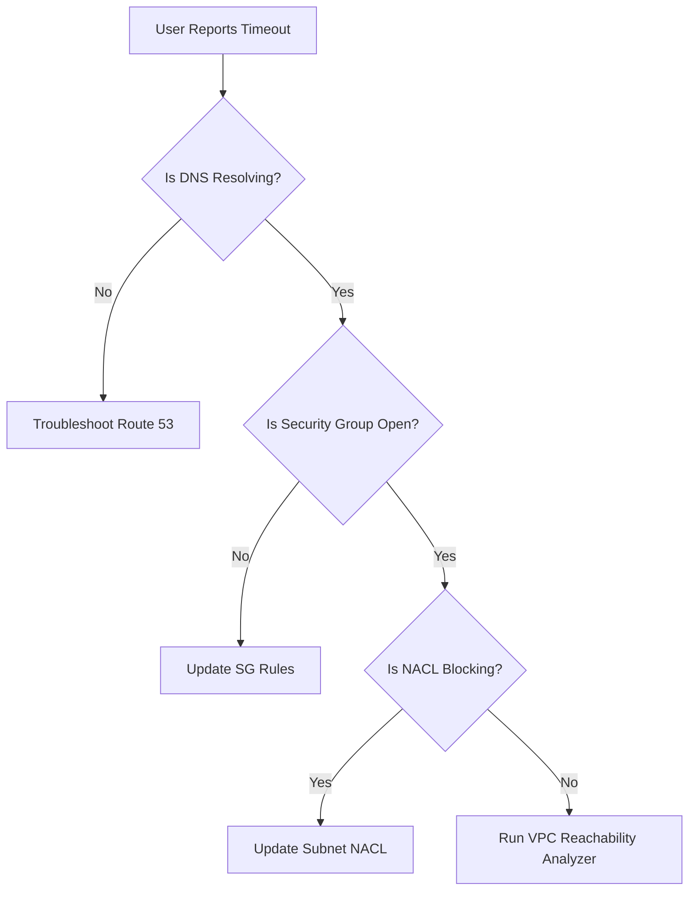

# Curriculum Overview: Network Troubleshooting and Monitoring

> [!IMPORTANT]
> This curriculum overview is mapped directly to Domain 5 (Networking and Content Delivery) of the AWS Certified CloudOps Engineer - Associate (SOA-C03) exam, focusing intensely on monitoring, logging, and troubleshooting network configurations.

## Prerequisites

Before diving into Network Troubleshooting and Monitoring on AWS, learners should have a solid foundation in both basic networking and AWS cloud primitives:

- **Foundational AWS Knowledge:** Familiarity with deploying core compute (EC2) and storage (S3) resources via the AWS Management Console and CLI.
- **Basic Networking Concepts:** Understanding of IPv4/IPv6, CIDR block notation, the OSI model (specifically Layer 3 and Layer 4), and fundamental DNS resolution.
- **Security Fundamentals:** A basic grasp of network firewalls, encryption in transit, and the principle of least privilege.
- **IAM Basics:** Understanding of identity-based policies versus resource-based policies.

## Module Breakdown

This curriculum is structured to take you from foundational VPC connectivity up to complex, multi-layered network troubleshooting using advanced AWS diagnostic tools.

| Module | Topic Focus | Difficulty | Estimated Time |
| :--- | :--- | :--- | :--- |
| **1** | VPC Configurations & Routing | Intermediate | 3.0 Hours |
| **2** | Route 53 & CloudFront Caching | Intermediate | 2.5 Hours |
| **3** | Telemetry: VPC Flow Logs & Alarms | Advanced | 3.0 Hours |
| **4** | Diagnostics: Reachability Analyzer & Hybrid Tech | Advanced | 4.0 Hours |

## Learning Objectives per Module

### Module 1: VPC Configurations & Routing
- **Configure Subnets and Gateways:** Deploy public and private subnets, Internet Gateways (IGW), and NAT Gateways to establish proper traffic routing.
- **Manage Traffic Flow:** Implement Security Groups (stateful) and Network ACLs (stateless) to secure inbound and outbound traffic at the instance and subnet levels.
- **Design Inter-VPC Connectivity:** Set up VPC Peering and Transit Gateways for scalable, multi-VPC and on-premises architectures.

### Module 2: DNS & Content Delivery
- **Configure DNS Services:** Utilize Route 53 Resolver and implement advanced routing policies (Latency, Weighted, Geolocation, Failover).
- **Optimize Content Distribution:** Configure Amazon CloudFront distributions, origins, and caching behaviors for global acceleration.
- **Manage Delivery Logs:** Enable query logging and interpret CloudFront access logs to track distribution efficiency.

### Module 3: Network Logging & Monitoring
- **Capture Traffic Patterns:** Deploy and configure VPC Flow Logs to inspect IP traffic data entering and exiting network interfaces.
- **Centralize Network Logs:** Collect and interpret Elastic Load Balancing (ELB) access logs, AWS WAF web ACL logs, and container networking logs.
- **Configure CloudWatch Network Monitoring:** Establish CloudWatch metrics and anomaly detection alarms for sudden network performance degradation.

### Module 4: Diagnostics & Troubleshooting
- **Diagnose Connectivity Issues:** Use the VPC Reachability Analyzer for automated, hop-by-hop network path validation between AWS resources.
- **Remediate Caching Issues:** Identify stale caches, configure proper cache invalidations, and tune Time-To-Live (TTL) settings in CloudFront to fix content delivery errors.
- **Troubleshoot Hybrid Networks:** Resolve private connectivity issues over AWS Direct Connect, AWS Site-to-Site VPN, and VPC Endpoints (PrivateLink).

## Success Metrics

How will you know you have mastered this curriculum? By meeting the following objective benchmarks:

1. **Certification Benchmark:** Consistently score 85% or higher on practice scenarios related to Domain 5 (Networking and Content Delivery) of the SOA-C03 exam.
2. **Diagnostic Proficiency:** Given a broken application connection scenario, successfully identify the root cause (e.g., a missing Route Table entry versus a restrictive Network ACL) within 5 minutes.
3. **Log Analysis Validation:** Accurately write a CloudWatch Logs Insights query using JMESPath syntax to filter out `REJECT` traffic within a VPC Flow Log.

> [!TIP]
> **Evaluating High Availability (HA) Networks**
> When configuring routing failovers, remember the overall availability formula when utilizing redundant network paths:
> $$ A_{total} = 1 - ((1 - A_1) \times (1 - A_2)) $$
> *Where $A_1$ and $A_2$ are the availability probabilities of the primary and secondary network paths.*

## Real-World Application

Network troubleshooting is often the most critical skill for a CloudOps Engineer. When an application "goes down," the network is almost universally the first suspect. 

### Triage Flowchart in the Real World

- **Reducing Downtime (MTTR):** Using automated tools like the VPC Reachability Analyzer replaces hours of manual `ping`, `traceroute`, and manual routing table checks with instantaneous path validation.
- **Cost Optimization:** By analyzing VPC Flow Logs, engineers can identify misconfigured services routing data over the public internet instead of using lower-cost VPC endpoints, potentially saving thousands in NAT Gateway data processing fees.
- **Global User Experience:** Effectively troubleshooting CloudFront caching issues ensures that users in remote geographic locations experience the same low-latency delivery as those right next to the origin server, directly impacting customer retention and satisfaction.