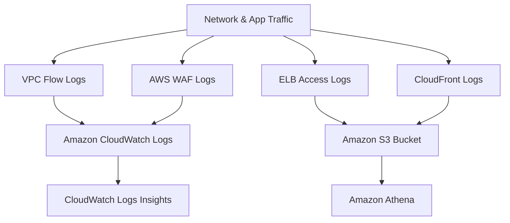
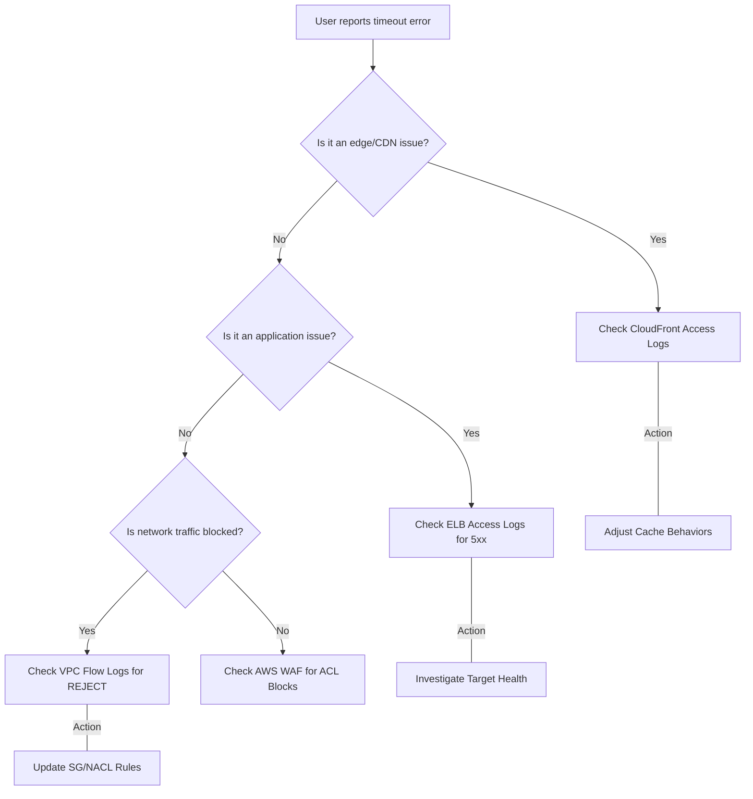

# Curriculum Overview: Troubleshooting with AWS Networking Logs

> This curriculum overview outlines the critical skills required to collect, manage, and interpret various networking logs within AWS to successfully troubleshoot connectivity and security issues, aligning directly with the AWS Certified SysOps Administrator - Associate (SOA-C03) exam objectives.

## Prerequisites

Before embarking on this curriculum, learners must possess a foundational understanding of AWS networking and management services:

*   **VPC Fundamentals:** Solid grasp of Virtual Private Clouds, subnets, route tables, Security Groups (SGs), and Network Access Control Lists (NACLs).
*   **Identity & Access Management (IAM):** Understanding of bucket policies (e.g., `s3:GetBucketPolicy` and `s3:PutBucketPolicy`) required for cross-service log delivery.
*   **Compute & Edge Basics:** Familiarity with EC2 instances, Elastic Load Balancing (ELB), and Amazon CloudFront.
*   **Monitoring Basics:** Basic experience navigating Amazon CloudWatch and Amazon S3.

## Module Breakdown

This curriculum is divided into four progressively complex modules, transitioning from fundamental infrastructure logging to advanced edge protection and centralized analysis.

| Module | Topic | Difficulty | Estimated Time |
| :--- | :--- | :--- | :--- |
| **Module 1** | **VPC Flow Logs & Infrastructure Diagnostics** | Beginner | 2 Hours |
| **Module 2** | **Load Balancing & Edge Delivery Logs** | Intermediate | 3 Hours |
| **Module 3** | **Network Protection & Security Logging** | Advanced | 3 Hours |
| **Module 4** | **Centralized Log Analysis & Querying** | Advanced | 2.5 Hours |

### System Architecture: AWS Logging Ecosystem

## Learning Objectives per Module

### Module 1: VPC Flow Logs & Infrastructure Diagnostics
*   **Configure VPC Flow Logs:** Learn to enable flow logging at the VPC, Subnet, or Elastic Network Interface (ENI) level.
*   **Interpret Flow Log Records:** Decode flow log syntax (e.g., `ACCEPT` vs. `REJECT`) to identify overly restrictive Security Groups or missing route table entries.
*   **Troubleshoot Reachability:** Use VPC Reachability Analyzer in tandem with flow logs to diagnose internal routing failures.

### Module 2: Load Balancing & Edge Delivery Logs
*   **Enable ELB Access Logs:** Configure Application and Network Load Balancers to deliver detailed request logs to Amazon S3.
*   **Diagnose HTTP Errors:** Differentiate between ELB-generated errors (e.g., `502 Bad Gateway`, `504 Gateway Timeout`) and target-generated errors using log fields.
*   **Analyze CloudFront Logs:** Identify cache hit/miss ratios (`x-edge-result-type`) and troubleshoot content distribution anomalies.

### Module 3: Network Protection & Security Logging
*   **AWS WAF Web ACL Logs:** Capture and analyze web request data to identify rate-based rule triggers, blocked IPs, and SQL injection attempts.
*   **Firewall Manager Central Logging:** Implement centralized logging for AWS Network Firewall and DNS Firewall across an AWS Organization.
*   **Container Logging:** Aggregate and interpret network logs from Amazon ECS and EKS workloads using the CloudWatch agent.

### Module 4: Centralized Log Analysis & Querying
*   **CloudWatch Logs Insights:** Write purpose-built queries to extract specific data from JSON log payloads efficiently.
*   **Correlate Events:** Combine data from AWS CloudTrail and VPC Flow Logs to trace the lifecycle of a compromised credential or unauthorized network scan.

### Log Type Comparison

| Log Type | Primary Source | Common Troubleshooting Use Case | Key Fields to Analyze | Storage Destination |
| :--- | :--- | :--- | :--- | :--- |
| **VPC Flow Logs** | ENI | Diagnosing SG/NACL connection drops | `srcaddr`, `dstaddr`, `action` | CloudWatch / S3 |
| **ELB Access Logs** | Load Balancers | Debugging HTTP timeouts and 5xx errors | `elb_status_code`, `target_status_code` | Amazon S3 |
| **WAF Web ACL Logs** | AWS WAF | Identifying blocked web exploits | `action`, `terminatingRuleId` | CloudWatch / S3 |
| **CloudFront Logs** | Edge Locations | Cache miss rates, geographic tracking | `x-edge-result-type` | Amazon S3 |

## Success Metrics

How will you know you have mastered this curriculum? You should be able to:

1.  **Metric 1:** Successfully configure an automated pipeline that sends ELB and VPC Flow logs to a centralized S3 bucket with the correct IAM bucket policies.
2.  **Metric 2:** Write a functional CloudWatch Logs Insights query that parses WAF logs to output the top 10 IP addresses blocked by rate-limiting rules.
3.  **Metric 3:** Resolve a simulated "application unreachable" scenario in under 15 minutes by pinpointing the exact Security Group or NACL rule causing a `REJECT` action in a VPC Flow Log.

## Real-World Application

In an enterprise environment, applications rarely fail with obvious, human-readable error messages. When a mission-critical web application suddenly drops offline, or users from a specific geographic region cannot access the system, the answer almost always lies in the networking logs.

By mastering this curriculum, you will transition from randomly guessing solutions to taking an evidence-based approach to incident response. Whether mitigating a sudden Distributed Denial of Service (DDoS) attack by identifying malicious source IPs in WAF logs, or proving to the development team that a database timeout is caused by an improperly configured subnets rather than bad application code, log analysis is the definitive tool for maintaining highly available, secure cloud architectures.