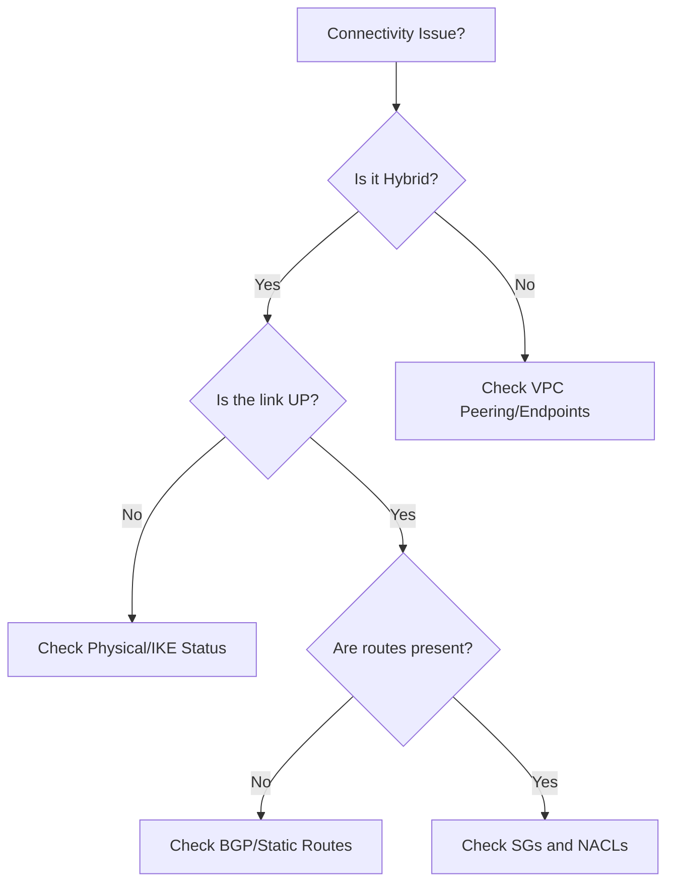

# Mastering Hybrid and Private Connectivity Troubleshooting

This guide focuses on **Skill 5.3.4** of the AWS SysOps Administrator Associate (SOA-C03) exam: identifying and remediating connectivity issues across hybrid environments and private AWS architectures.

## Learning Objectives
After studying this guide, you should be able to:
*   Diagnose state and routing issues for **AWS Site-to-Site VPN** and **Direct Connect (DX)**.
*   Troubleshoot **VPC Peering** and **Transit Gateway** connectivity across accounts and regions.
*   Identify misconfigurations in **VPC Endpoints** (Interface vs. Gateway).
*   Use **VPC Reachability Analyzer** and **VPC Flow Logs** to isolate network path failures.
*   Resolve issues related to overlapping CIDR blocks and incorrect Route Table entries.

## Key Terms & Glossary
*   **Customer Gateway (CGW):** The physical device or software application on your side of the Site-to-Site VPN connection.
*   **Virtual Private Gateway (VGW):** The VPN concentrator on the Amazon side of the VPN connection.
*   **Direct Connect Gateway (DXGW):** A grouping object that allows you to connect a Direct Connect connection to VPCs in any Region (except China).
*   **VPC Endpoint (AWS PrivateLink):** Enables private connections between your VPC and supported AWS services without requiring an internet gateway or NAT device.
*   **Transit Gateway (TGW):** A network transit hub that connects VPCs and on-premises networks through a central managed entity.

## The "Big Idea"
Hybrid and private connectivity is about **extending the trust boundary**. Instead of routing traffic over the public internet, we use encrypted tunnels (VPN) or dedicated physical lines (Direct Connect) and private backbones (PrivateLink). Troubleshooting these requires a layered approach: first verify the physical/logical link (Layer 1-3), then the routing (Layer 3), and finally the security permissions (Security Groups/NACLs).

## Formula / Concept Box

| Connectivity Type | Primary Use Case | Protocol / Mechanism | Common Bottleneck |
| :--- | :--- | :--- | :--- |
| **Site-to-Site VPN** | Quick, encrypted hybrid link | IPsec | Internet congestion / MTU |
| **Direct Connect** | Consistent, high-bandwidth | 802.1q VLAN / BGP | Cross-connect / LOA-CFA |
| **VPC Peering** | One-to-one VPC connection | AWS Backbone | Overlapping CIDRs |
| **Transit Gateway** | Hub-and-Spoke (Scale) | TGW Route Tables | Propagations vs. Static Routes |
| **VPC Endpoints** | Private AWS Service Access | ENIs (Interface) / Prefix Lists (Gateway) | DNS Resolution / Endpoint Policy |

## Hierarchical Outline
1.  **Hybrid Connectivity (On-Prem to AWS)**
    *   **Site-to-Site VPN**: Verifying Tunnel Status (UP/DOWN). Check IKE/IPsec Phase 1 & 2 logs.
    *   **Direct Connect**: BGP Session status. Checking Light Levels (Tx/Rx) and Virtual Interface (VIF) types.
2.  **Private Inter-VPC Connectivity**
    *   **VPC Peering**: Status must be `active`. Routes must point to `pcx-...` IDs. NACLs must allow return traffic.
    *   **Transit Gateway**: Attaching VPCs to TGW. Managing TGW Route Tables and ensuring the VPC Route Table has a default or specific route to the `tgw-...`.
3.  **Service Connectivity (PrivateLink)**
    *   **Interface Endpoints**: DNS Hostnames must be enabled in VPC. Security Group on the ENI must allow inbound traffic from the source.
    *   **Gateway Endpoints (S3/DynamoDB)**: Prefix lists in the Route Table. No Security Group on the endpoint itself (uses Endpoint Policies).

## Visual Anchors

### Hybrid Connectivity Decision Flow

### VPC Endpoint Traffic Paths
\begin{tikzpicture}[node distance=2cm, every node/.style={draw, rectangle, align=center, fill=blue!10}]
    \node (Instance) {Private Instance\\(10.0.1.5)};
    \node (Endpoint) [right=of Instance, fill=green!10] {Interface\\Endpoint (ENI)};
    \node (S3) [right=of Endpoint, fill=orange!10] {AWS Service\\(Kinesis/SQS)};
    \node (IGW) [above=of Endpoint, fill=red!10] {Internet\\Gateway};

    \draw[->, thick, green!60!black] (Instance) -- (Endpoint) node[midway, below] {\tiny Private IP};
    \draw[->, thick, green!60!black] (Endpoint) -- (S3) node[midway, below] {\tiny Backbone};
    \draw[->, thick, red, dashed] (Instance) -- (IGW) node[midway, left] {\tiny Blocked};
\end{tikzpicture}

## Definition-Example Pairs
*   **Asymmetric Routing**: When a packet follows one path to the destination but the return packet follows a different path, often causing stateful firewalls (Security Groups) to drop the traffic.
    *   *Example*: Traffic goes to on-premises via Direct Connect but returns via VPN.
*   **MTU (Maximum Transmission Unit)**: The largest size of a packet that can be sent over a network.
    *   *Example*: A VPN tunnel supports 1500 bytes but the inner packets are 1500 bytes + headers, causing fragmentation and slowness; solution is to lower the MSS (Maximum Segment Size) or MTU to 1399.

## Worked Examples

### Example 1: The Invisible S3 Bucket
**Problem:** An EC2 instance in a private subnet cannot access an S3 bucket, despite having an IAM role with `S3FullAccess`. There is no NAT Gateway.
**Solution Steps:**
1.  **Identify the need for a Gateway Endpoint**: Since there is no NAT/IGW, the traffic has nowhere to go.
2.  **Create the S3 Gateway Endpoint**: Associate it with the private subnet's Route Table.
3.  **Verify Route Table**: Ensure a route exists where the Destination is `pl-xxxxxx` (S3 Prefix List) and the Target is `vpce-xxxxxx`.
4.  **Check Endpoint Policy**: Ensure the policy on the endpoint itself isn't restricting access to the bucket.

### Example 2: Transit Gateway Route Conflict
**Problem:** VPC-A can talk to the On-Premise data center via Transit Gateway, but VPC-B cannot, even though both are attached to the same TGW.
**Solution Steps:**
1.  **Check TGW Route Table**: Does the TGW have a route for VPC-B's CIDR? (Propagations).
2.  **Check VPC-B Route Table**: Does it have a route for the On-Premise CIDR pointing to the `tgw-id`?
3.  **Check Security Groups**: Does the On-Premise firewall allow traffic from VPC-B's specific IP range? (Commonly forgotten).

## Checkpoint Questions
1.  What tool provides a visual "hop-by-hop" path analysis to find a blocked port between two VPC resources?
2.  True or False: VPC Peering supports transitive routing (VPC A -> B -> C).
3.  Why might a Direct Connect BGP session show as "Down" even if the physical light levels are good?
4.  Which VPC Endpoint type requires manual DNS configuration if "Private DNS" is not enabled?

Click to see answers

1. **VPC Reachability Analyzer.**
2. **False.** You must peer A to C directly or use Transit Gateway.
3. **Mismatched ASN (Autonomous System Number) or MD3 Auth Key.**
4. **Interface Endpoint.**

