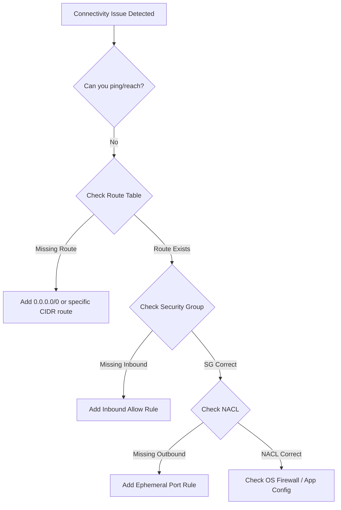

# Mastering VPC Troubleshooting: Connectivity and Configuration

This guide covers the essential techniques and conceptual frameworks required to diagnose and resolve connectivity issues within Amazon Virtual Private Cloud (VPC), specifically focusing on subnets, route tables, security groups, and gateways.

## Learning Objectives
By the end of this guide, you will be able to:
- Differentiate between stateful and stateless filtering issues.
- Identify misconfigurations in public and private subnet routing.
- Resolve connectivity bottlenecks in NAT Gateways and Transit Gateways.
- Use AWS diagnostic tools like VPC Reachability Analyzer and Flow Logs to isolate failures.

## Key Terms & Glossary
- **Stateful Filtering**: A security mechanism where the firewall remembers the state of active connections (e.g., Security Groups). If an inbound request is allowed, the outbound response is automatically allowed.
- **Stateless Filtering**: A mechanism that does not remember connection states; rules must be explicitly defined for both inbound and outbound traffic (e.g., Network ACLs).
- **Ephemeral Ports**: Short-lived transport protocol ports for IP communications, typically ranging from 1024 to 65535. These are crucial for return traffic in NACLs.
- **CIDR (Classless Inter-Domain Routing)**: A method for allocating IP addresses and IP routing. Example: `10.0.0.0/16`.
- **Implicit Deny**: The default behavior of security groups and NACLs where any traffic not specifically allowed is blocked.

## The "Big Idea"
Networking in AWS is a **layered defense and routing system**. Troubleshooting is rarely about a single broken component but rather a "break in the chain." A packet must pass through the Route Table, then the Network ACL, and finally the Security Group. If any one of these is misconfigured, the entire connection fails. Think of it as a series of gates: even if the first two are open, a closed third gate stops the journey.

## Formula / Concept Box

| Feature | Security Group (SG) | Network ACL (NACL) |
| :--- | :--- | :--- |
| **Level** | Instance / ENI Level | Subnet Level |
| **State** | **Stateful**: Return traffic is auto-allowed | **Stateless**: Return traffic needs a rule |
| **Rules** | Support "Allow" rules only | Support "Allow" and "Deny" rules |
| **Evaluation** | All rules evaluated before decision | Rules processed in number order (lowest first) |
| **Use Case** | Host-level micro-segmentation | Subnet-wide coarse filtering |

## Hierarchical Outline
1. **Layer 1: Routing Logic**
    - **Subnet Association**: Ensuring the subnet is linked to the correct route table.
    - **The Default Route**: `0.0.0.0/0` destination pointing to the correct gateway (IGW for public, NATGW for private).
    - **Edge Cases**: Managing overlapping CIDR blocks in VPC Peering.
2. **Layer 2: Security Filtering**
    - **Security Group Scoping**: Checking if the source is an IP range or another Security Group ID.
    - **NACL Return Traffic**: Opening ephemeral ports for responses to outbound requests.
3. **Layer 3: Intermediate Gateways**
    - **NAT Gateway**: Checking for "Standard" vs. "Interface" failures and bandwidth exhaustion.
    - **Transit Gateway (TGW)**: Verifying TGW Attachments and TGW Route Tables across multiple VPCs.
4. **Diagnostics & Tools**
    - **VPC Reachability Analyzer**: Static analysis of the network path.
    - **VPC Flow Logs**: Real-time traffic analysis (REJECT vs. ACCEPT).

## Visual Anchors

### Troubleshooting Flowchart

### Packet Flow Visualization
\begin{tikzpicture}[node distance=2cm, auto]
    \draw[thick, blue!50, fill=blue!5] (0,0) rectangle (10,4);
    \node at (5, 3.7) {\textbf{AWS VPC}};
    
    \draw[thick, fill=green!10] (1,0.5) rectangle (3,3);
    \node at (2, 1.7) [align=center] {\small Route\\\small Table};
    
    \draw[thick, fill=orange!10] (4,0.5) rectangle (6,3);
    \node at (5, 1.7) [align=center] {\small Network\\\small ACL};
    
    \draw[thick, fill=red!10] (7,0.5) rectangle (9,3);
    \node at (8, 1.7) [align=center] {\small Security\\\small Group};
    
    \draw[->, ultra thick, gray] (-1, 2) -- (0.9, 2) node[midway, above] {Packet};
    \draw[->, ultra thick, gray] (3.1, 2) -- (3.9, 2);
    \draw[->, ultra thick, gray] (6.1, 2) -- (6.9, 2);
    \draw[->, ultra thick, gray] (9.1, 2) -- (11, 2) node[midway, above] {EC2};
\end{tikzpicture}

## Definition-Example Pairs
- **Route Table Propagation**: 
    - *Definition*: The ability of a gateway (like a VPG) to automatically inject routes into a VPC route table.
    - *Example*: When setting up a Direct Connect, you enable route propagation so the on-premises IP ranges automatically appear in your VPC route table without manual entry.
- **Asymmetric Routing**:
    - *Definition*: When a packet takes one path to the destination and a different path back to the source.
    - *Example*: An EC2 instance sends traffic via a Transit Gateway, but the return traffic is blocked because the destination's route table points back through a legacy VPC Peering link instead of the Transit Gateway.

## Worked Examples

### Case 1: Public Instance is Unreachable
**Problem**: An EC2 instance in a "Public Subnet" has a Public IP but cannot be reached via SSH.
**Step-by-Step Resolution**:
1. **Check Route Table**: Ensure there is a route for `0.0.0.0/0` pointing to an **Internet Gateway (igw-xxxx)**. If it points to a NAT Gateway, it is not a public subnet.
2. **Check Security Group**: Ensure Inbound rule allows TCP Port 22 from your specific IP or `0.0.0.0/0`.
3. **Check Network ACL**: Ensure Inbound rule allows Port 22 AND Outbound rule allows Ephemeral Ports (1024-65535) for the response.
4. **Result**: Found that the NACL outbound rule was missing. Added rule, and SSH access was restored.

### Case 2: Transit Gateway Cross-VPC Failure
**Problem**: VPC A cannot communicate with VPC B through a Transit Gateway.
**Step-by-Step Resolution**:
1. **Attachment**: Verify VPC A and VPC B both have a "Transit Gateway Attachment."
2. **VPC Route Tables**: Ensure VPC A's route table has a route for VPC B's CIDR pointing to the **tgw-xxxx** ID.
3. **TGW Route Table**: Check the Transit Gateway's own route table. Verify that the attachment for VPC A is *associated* with the table and the route for VPC B is *propagated*.
4. **Security Groups**: Ensure VPC B's Security Group allows the CIDR range of VPC A.

## Checkpoint Questions
1. Why would a ping (ICMP) fail if the Security Group allows all inbound traffic but the NACL only allows inbound traffic?
2. What tool would you use to quickly see if a packet is being dropped by a Security Group vs. an OS-level firewall?
3. An instance in a private subnet needs to download updates but cannot. The NAT Gateway is active. What is the most likely missing route?

<b>Click for Answers</b>

1. Because NACLs are stateless. You must also allow outbound ICMP/Ephemeral traffic in the NACL for the response to reach the source.
2. VPC Reachability Analyzer (shows network path) or VPC Flow Logs (shows 'REJECT' at the AWS level).
3. The private subnet's route table must have a route for `0.0.0.0/0` pointing to the NAT Gateway ID (nat-xxxx).

