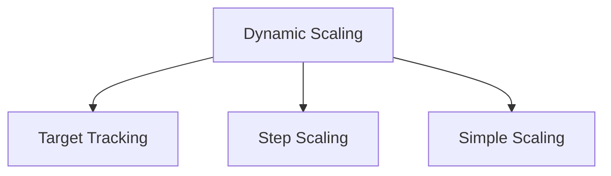
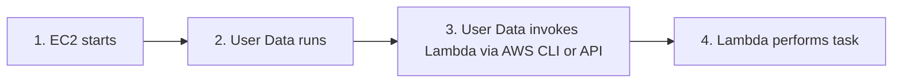
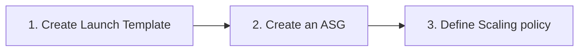

## 1. EC2 Esential

### 1.1. ENI and ENA

ENA stands for Elastic Network Adapter - In AWS, most instance family support ENA - ENA = the networking technology/device at hypervisor hardware.

ENI stands for Elastic Network Interface - This is the network identity attached to the network card.


### 1.2 Purchase Options

1. On-Demand

2. Reserved Instances (Standard vs. Convertible)

Note:
- User commit to use/pay an instance for long term (1-3 years)

3. Savings Plans

Note:
- User commit to pay x price per hour for long term (1-3 years)
- Apply for other instance service like Lambda, Fargate,...

4. Spot Instances

5. Dedicated Hosts vs. Dedicated Instances

Note:
- Dedicated Host - User control entire physical host/hardware + Used for BYOL, socket control
- Dedicated Instance - Host not shared with anyone else

6. On-Demand Capacity Reservations (ODCR)

Note:
For DR event - User reserve an instance capability for failover.

### 1.3. EC2 Instance Status

**System status check failure** → underlying hardware/hypervisor/network issue on AWS's side. Remediation: stop/start (moves to new hardware), not reboot.

**Instance status check failure** → OS-level issue (corrupted file system, kernel panic, exhausted memory, misconfigured network). Remediation: reboot, or fix via user data / EC2 Serial Console / EC2Rescue.

Note:
- CloudWatch has a default `StatusCheckFailed_System` and `StatusCheckFailed_Instance` metric

### 1.4. EC2 Placement Group

**Cluster** — single AZ, low-latency/high-throughput (HPC, tightly coupled MPI workloads). Can't span AZs.

**Spread** — up to 7 instances per AZ, each on distinct underlying hardware — for small numbers of critical instances needing isolation from correlated hardware failure.

**Partition** — up to 7 partitions per AZ, each partition = distinct racks with own network/power; instances in one partition don't share hardware with another. Used for HDFS, Cassandra, Kafka — distributed systems that handle their own replication and want partition-level fault isolation.


## 2. Auto-Scaling Group (ASG)

### 2.1. Scaling Policy

#### 2.1.1. **Manual Scaling**

By change the "Desire Capacity" in the ASG -> Instances automatically scale in or scale out.

#### 2.1.2. **Scheduled Scaling**

Schedule the scaling based on point of time

For example

```
aws autoscaling put-scheduled-update-group-action --scheduled-action-name inc-at-9am \
  --auto-scaling-group-name awscoban-asg --recurrence "0 9 * * *" --desired-capacity 3 

aws autoscaling put-scheduled-update-group-action --scheduled-action-name dec-at-7pm \
  --auto-scaling-group-name awscoban-asg --recurrence "0 19 * * *" --desired-capacity 1
```

#### 2.1.3. **Dynamic Scaling**

Dynamic Scaling needs the configuration with CloudWatch metrics


A. Target Tracking Scaling

Based on the target mectric and the value, ASG automatically scale-in or scale-out to maintain the target metric's value.

B. Step Scaling

For example:

When CPUUtilization increases 50%, add 1 Instance.
When CPUUtilization increases 75%, add 2 more Instances.
When CPUUtilization reduces 75%, terminate 2 Instances.
When CPUUtilization reduces 50%, terminate 1 more Instance.

C. Simple Scaling

Same as Step Scaling, however, there is only 1 step to configure.

4. **Predictive Scaling**

As the name described, using AI/ML to trigger the scale-in or scale-out event


### 2.2. Instance Management and Instance Refresh in ASG

#### 2.2.1. Lifycycle Hook

In the big picture:


To make sure EC2 instances ready in an ASG, we use Lifecycle Hook to pause the Scale-in or Scale-out event within a specific time.

Lifecycle hook help ASG status in a `Wait` state to perform additional tasks.


In configuration, when creating an ASG:


Note: **Launch Template** help define the EC2 instance specification across instances in ASG

Next, to configure lifecycle hook:

```AWS CLI
aws autoscaling put-lifecycle-hook \
    --auto-scaling-group-name awscoban-asg \
    --lifecycle-hook-name waiting-user-data \
    --lifecycle-transition autoscaling:EC2_INSTANCE_LAUNCHING \
    --heartbeat-timeout 3600
```
- `autoscaling:EC2_INSTANCE_LAUNCHING` is for Hook when scale-out
- `autoscaling:EC2_INSTANCE_TERMINATING` is for Hook when scale-in
- `DefaultResult: CONTINUE or ABANDON`. On launch, ABANDON = terminate and replace. On termination, both CONTINUE and ABANDON let the instance terminate — ABANDON skips remaining hooks, CONTINUE lets other terminate-hooks run first.
(Default Result is to define what to do in the event Hook process timeout or not respond)

#### 2.2.2. Instance Refresh

Replaces all instances in an ASG following a launch template change (new AMI, new instance type, etc.)

Key parameters:

- MinHealthyPercentage (default 90%) — minimum percentage of the desired capacity that must remain healthy during the refresh.

- MaxHealthyPercentage (default 100%, can go up to 200% since the newer versions) — allows launching extra temporary capacity above desired count.

- Supports a checkpoint system: pause at specified percentages of instances replaced, useful for canary-style rollout validation before continuing.

#### 2.2.3. Warm Pool

Pre-initializes and keeps a pool of `stopped` (default) or `running` or `hibernated` instances outside the ASG

Note:  Stopped state, which avoids compute charges but still bills EBS

#### 2.2.4. StandBy state

In the event of instance needs patching or modifications, ASG allows Instances to be in `StandBy` state.


